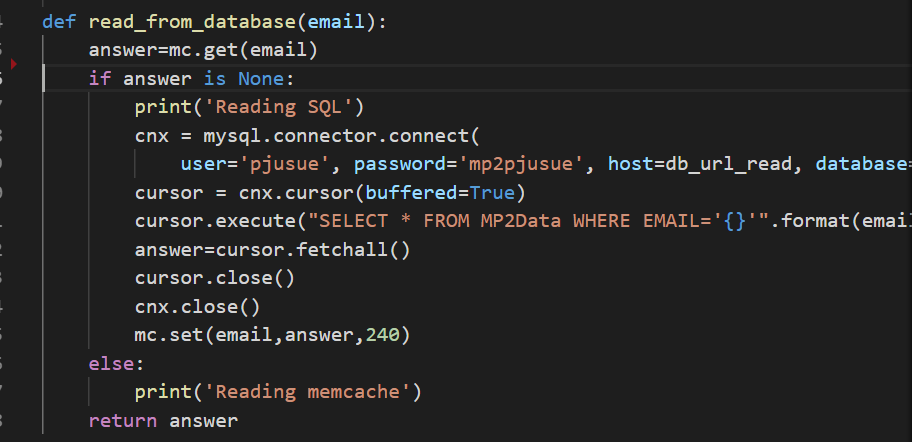

# Mini Project 3
## 1. Project description
This project is based in the previous Mini Project 2.  In this one, I have developed an autoscaling policy so, the system will be able to create more or less instances depending of the amount of trafic. Also the server has two more pages.
The database reading part will be done using a database read-only replica and the writing operations will be done in the original one.

* Gallery is the page in which the images which have been uploaded will be shown. Also the flipped ones will be shown. Each photo will have a caption so the user can know if it is the edited or the original one. Also, the access to this page will be based on the session of the user. This session will be defined when the user introduces his email when he uploads a picture. When the user access to the gallery he will only have access to his pictures. The session can be deleted by clicking on the log out button in the admin page and in the form page.

* The administrator page allows the user to block the uploads or unblock them if they were block. Also allows to create a dump of the database.

The additional feature which I have implemented is the elastic cache in the gallery page.
The elastic cache based on memcache is a memory storage based on key/value architecture. So the key is the email account of the user, which identifies the session established by the user, and the value is the rest of the information storaged in the database. The algorithm used is the following one:
* When the user wants to see the gallery, the algorithm search in the first place in the memory cache. If there is no information related to that email account, it performs the query to the MySQL database and storage the data in the memory cache, so in memory  there is always information only about one email account.

The next problem is when the user uploads another image because when the user access to the gallery page the query will be done against memory and because there are data there related to the email, there won't be query to the MySQL databased. The big problem is that the last photo which the user has uploaded will not be on the memory cache.

For solving this my algorithm checks, when the users uploads a picture if there is any information related to that session in the memory cache. If there is, it will perform the SQL insert query, and also that information will be updated on the cache.

Because it is imposible to know by using the application if the information has been read from the SQL or from the memory cache I have write a cupple of prints to check from where was the read done.

## 2. Parts of the project
This project has the following files:
* Create-app.sh is an script which will load all the configuration in the instances managed by the load balancer.
* Create-backend2.sh is an script which will load all the configuration in the instance which will perform the photo modification.
* create-env.sh is the script which will be run by the user to create the full environment
* destroy-env.sh is the script which will destroy the environment (It deletes all the .priv files storaged in the directory, so be careful when running it.)
* MP2.json is the policy file

In the pythonPrograms folder we will find:
* imageprocessor.py which is the software which is going to edit the photo and upload the modification to the bucket
* uploadimages.py which is the software which is going to create the server to upload the photo, persist the information into the database, upload the photo to the bucket and send a message to the imageprocessor.py

Then in the templates folder:
* imageupload.html which is the web page to upload the file.
* admin.html which is the web page of the administrator in which the user will be able to perform a block of the uploads, an unblock and a dump of the SQL database.
* gallery.html is the page in which the images can be seen.

In the static folder we have the .css files.
* basic.css
* style.css
## 3. User action
For running the create-env.sh the user can introduce the ami uploaded to the blackboard in the MP1 as a positional parameter or not introduce any ami. The rest of the parameters used by the program and which are going to be defined by the user will be asked during the program execution.

The page runs in the port 5000 and has no page in the "/" path so for starting the program the user must go to :5000/form

## 4. Video
https://www.youtube.com/watch?v=mSO50UsF0m8
